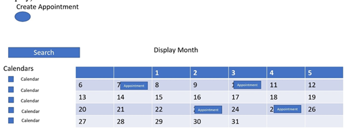

[Back to Portfolio](./)

Calendar
===============

-   **Class:** CSCI 325
-   **Grade:** 80
-   **Language(s):** Java
-   **Source Code Repository:** [Calendar](https://github.com/noseypringles/Calendar/tree/master/CalendarProject/src/csu/csci325)  
    (Please [email me](mailto:kequick@csustudent.net?subject=GitHub%20Access) to request access.)

## Project description
This program is a calendar that was made in the platform netbeans. We are creating an interactable calendar that will allow users to control their schedules, document appointments, and manage their time. This calendar offers the user full control of their personal times and prevents them from overbooking appointments. The calendar will be accurate, including leap years and holidays.

## How to view program
The user would need to have access to netbeans to run the program. After hitting run, a gui box should pop up with the calendar displayed.

## UI Design
The Calendar Program will allow users to create, manage, and view their own personal calendars. The Calendar Program will allow users to have control over their calendars that display their appointments. The user will begin will adding a calendar name, title, date, time, description, and place of the appointment.  Our GUI will resemble common features found in Microsoft Outlook Calendar or Google Calendar.

  
Fig 1. Display Day

  
Fig 2. Display Month

  
Fig 3. Display Year

  
Fig 4. Find Appointment

  
Fig 4. Create Appointment

## 3. Additional Considerations

The program currently has a problem of being pulled up to display the gui in netbeans. Here is the [design document](/pdf/DesignDocumentCalendar.pdf)

For more details see [GitHub Flavored Markdown](https://guides.github.com/features/mastering-markdown/).

[Back to Portfolio](./)
